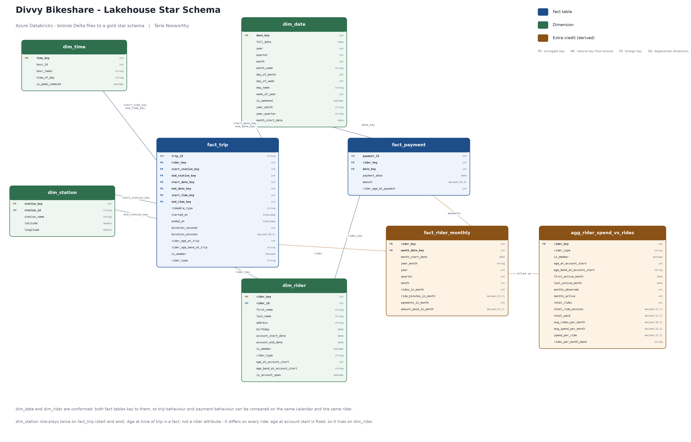
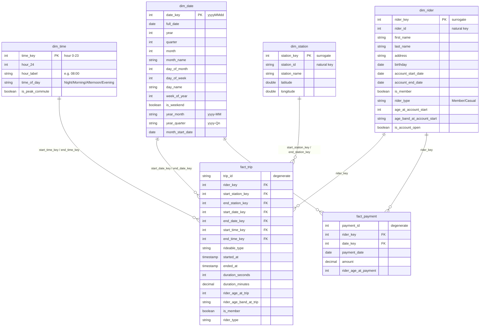

# Divvy Bikeshare — Lakehouse Star Schema Design

## 1. The source (what is *actually* in the CSV files)

Four headerless CSVs ship with the project. Every count and every claim below was verified
directly against the files, not inferred from the ERD image:

| file | rows | columns (positional — the files have no header row) |
|---|---:|---|
| `riders.csv` | 75,000 | `rider_id, first, last, address, birthday, account_start_date, account_end_date, is_member` |
| `payments.csv` | 1,946,607 | `payment_id, date, amount, rider_id` |
| `stations.csv` | 838 | `station_id, name, latitude, longitude` |
| `trips.csv` | 4,584,921 | `trip_id, rideable_type, started_at, ended_at, start_station_id, end_station_id, rider_id` |

Facts about the data that drive design decisions:

* **Station identifiers are not integers.** The classroom ERD types `Station.station_id` as
  `varchar` but `Trip.start_station_id` / `Trip.end_station_id` as `int`. A key and its foreign
  key cannot have different types, and the data settles the argument: **306 of 838 station ids
  are non-numeric** (`KA1503000012`, `TA1305000029`), while the rest look like `525`. Station
  identifiers are carried as **strings** everywhere in this design. Typing them as `int` would
  silently null out 36% of the stations.
* **Referential integrity is already clean.** Zero orphans: every `trip.rider_id` and
  `payment.rider_id` resolves to a rider, and every start/end station id resolves to a station.
  The design still routes unmatched rows to an "Unknown" member rather than dropping them —
  the pipeline should not depend on the source staying clean.
* **There is no `account` entity.** The ERD hints at one; the data has four tables. Membership
  and account lifespan are **rider attributes**, so they live on `dim_rider`. There is no
  `dim_account`, and `payment` joins to `rider` directly on `rider_id`.
* **Payments are a monthly subscription charge** — exactly one payment per rider per calendar
  month, never more. That is what makes a rider-month grain the natural place to compare
  spend against ride behaviour.
* **Date ranges differ sharply between the facts.** Payments and accounts run 2013-01 to
  2022-02; trips only cover 2021-02 to 2022-02. `dim_date` is built from the union of both so
  the payment history is not truncated to the trip window.
* **Trip durations are not all sane.** 197 trips end at or before they start, and the longest
  is 38 days. These are reported by the pipeline, not deleted — see §6.

## 2. Star schema

Two transaction fact tables sharing conformed dimensions, plus two derived tables for the
extra credit.

The submission copy is [`star_schema.pdf`](star_schema.pdf). Regenerate both with
`python tools/render_star_schema.py`. The Mermaid source below is the machine-readable
version of the same diagram.

### Fact grain

| fact | grain | measures | degenerate / role-playing |
|---|---|---|---|
| `fact_trip` | one row per trip | `duration_seconds`, `duration_minutes`, `rider_age_at_trip` | `trip_id` (degenerate), `rideable_type`; `dim_date` and `dim_time` role-play as trip start and trip end; `dim_station` role-plays as start and end station |
| `fact_payment` | one row per payment | `amount`, `rider_age_at_payment` | `payment_id` (degenerate) |

`rider_age_at_trip` sits on the fact rather than the dimension because age is a
**point-in-time** value: the same rider is a different age on two different trips. Putting it
on `dim_rider` would turn it into a slowly-changing-dimension problem the project does not
ask for. `age_at_account_start` *is* fixed per rider, so it lives on `dim_rider` — which is
exactly what business outcome 2b needs.

### Key strategy

Every dimension **generates a surrogate key** with `row_number()` over an ordered window, and
keeps its natural key beside it for lineage back to bronze:

| dimension | surrogate key | natural key |
|---|---|---|
| `dim_rider` | `rider_key` | `rider_id` |
| `dim_station` | `station_key` | `station_id` |
| `dim_date` | `date_key` (`yyyyMMdd`) | — generated from a date spine |
| `dim_time` | `time_key` (hour `0..23`) | — generated |

`dim_date` and `dim_time` use meaningful integer keys (`20210214`, `17`) rather than opaque
counters: they sort correctly, they are readable in a result set, and they are stable across
rebuilds.

> **Why this differs from the Synapse version of this project.** In the serverless SQL pool,
> the dimensions were keyed on their *natural* keys — there is no `IDENTITY`, CETAS cannot
> enforce a primary key, and a surrogate would have bought nothing but an extra lookup. Spark
> has no such limitation: a windowed `row_number()` is dense, deterministic and rebuildable,
> so here the dimensions generate real surrogates. The two projects reach different answers
> from the same reasoning applied to different engines.

`dim_rider` and `dim_station` each carry an **Unknown member at key `-1`**. Fact lookups are
left joins that coalesce a miss onto `-1`, so a fact row is never dropped for want of a
dimension row, and the count of rows that landed on `-1` is reported as a data-quality metric.

## 3. Business outcomes → schema coverage

| # | Business outcome | Answered by |
|---|---|---|
| 1 | Time spent per ride | `fact_trip.duration_minutes` |
| 1a | …by day of week / time of day | `dim_date.day_name`, `dim_time.time_of_day` via `start_date_key` / `start_time_key` |
| 1b | …by start / end station | `dim_station` joined twice, on `start_station_key` and `end_station_key` |
| 1c | …by rider age at time of the ride | `fact_trip.rider_age_at_trip`, `rider_age_band_at_trip` |
| 1d | …by member vs casual | `fact_trip.is_member` / `rider_type`, carried onto the fact so the question needs no join |
| 2 | Money spent | `fact_payment.amount` |
| 2a | …per month, quarter, year | `dim_date.year`, `quarter`, `month`, `year_month`, `year_quarter` |
| 2b | …per member by age at account start | `dim_rider.age_at_account_start`, `age_band_at_account_start` |
| 3 | **EXTRA CREDIT** — money per member vs rides averaged per month | `fact_rider_monthly` (rider × month) and `agg_rider_spend_vs_rides` (rider grain, with `avg_rides_per_month` and a banding column) |

Notebook `03_gold_facts` ends with one runnable query per row of this table.

## 4. Extra credit tables

**`fact_rider_monthly`** — grain: one row per rider per calendar month in which the rider was
active. Conforms rides and payments onto a common grain so they can be compared without a
fan-out join. Joining `fact_trip` to `fact_payment` directly would pair every trip with every
payment for that rider and multiply both measures; aggregating each side first and then
outer-joining keeps the arithmetic honest. The join is a **full outer** join on purpose — a
rider can pay in a month with no rides, and ride in a month with no payment.

| column | meaning |
|---|---|
| `rider_key` | grain: the rider |
| `month_date_key` | `yyyyMM01` int, joins `dim_date` on the first of the month |
| `month_start_date`, `year_month`, `year`, `quarter`, `month` | calendar parts, so the fact can be sliced without a join |
| `rides_in_month`, `ride_minutes_in_month` | trip activity that month |
| `payments_in_month`, `amount_paid_in_month` | payment activity that month |

**`agg_rider_spend_vs_rides`** — grain: one row per rider. Rolls the monthly fact up to
lifetime totals and derives the ratios the business outcome actually asks for, so the answer
is a single `GROUP BY`.

| column | meaning |
|---|---|
| `rider_key` | grain: the rider |
| `rider_type`, `is_member`, `age_at_account_start`, `age_band_at_account_start` | carried from `dim_rider` so the rollup needs no join |
| `first_active_month`, `last_active_month` | bounds of the observation window |
| `months_observed` | first to last active month, inclusive — the denominator |
| `months_active` | months in which the rider actually rode |
| `total_rides`, `total_ride_minutes`, `total_paid` | lifetime totals |
| `avg_rides_per_month` | `total_rides / months_observed` |
| `avg_spend_per_month` | `total_paid / months_observed` — tenure-neutral |
| `spend_per_ride` | `total_paid / total_rides` |
| `rides_per_month_band` | banding of `avg_rides_per_month`, so the answer is one `GROUP BY` |

`months_observed` is the span from first to last activity rather than a count of active
months. A rider who took a three-month break should not be flattered by having their spend
divided only by the months they showed up.

## 5. Medallion layout

| layer | database | contents | written by |
|---|---|---|---|
| **Bronze** | `bronze` | `rider`, `payment`, `station`, `trip` — a typed but otherwise faithful copy of the CSVs, Delta files under `/delta/bronze/` with tables registered over them by `spark.sql` | `01_bronze_extract_load` |
| **Gold** | `gold` | `dim_rider`, `dim_station`, `dim_date`, `dim_time`, `fact_trip`, `fact_payment`, `fact_rider_monthly`, `agg_rider_spend_vs_rides` — Delta files under `/delta/gold/` | `02_gold_dimensions`, `03_gold_facts` |

No business logic runs in bronze: no joins, no filtering, no rows dropped. That keeps the raw
layer re-runnable and auditable against the source CSVs, and means a modelling mistake is
always fixable by rebuilding gold alone.

## 6. Data quality stance

The gold layer **reports** anomalies rather than deleting them:

* 197 trips (of 4.58M) end at or before they start; the longest trip is 38 days. `fact_trip`
  keeps them and the audit cell counts them, so an analyst can filter with
  `WHERE duration_minutes > 0` when a question calls for it.
* Rows that fail a dimension lookup land on the `-1` Unknown member and are counted.
* Notebook 03 audits every foreign key with a `LEFT ANTI JOIN` against its dimension and
  prints the orphan count, which must be zero.

Silently dropping rows in the transform would make the gold row counts stop reconciling with
bronze, and the discrepancy would be invisible at query time. Counting them keeps the
pipeline honest.
